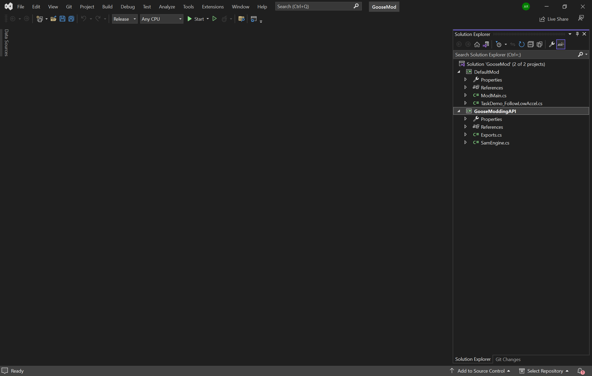

# 3. Understanding the mod file

So you just open up the mod and I explain it.

## Opening the mod project

1. Go into the "**FOR MOD-MAKERS**" folder, then navigate into the "**GooseMod_DefaultSolution**" folder.

2. Open "**GooseMod.sln**" in Visual Studio.

You should now been on a screen somewhat like this:

## Woah! What is all of this?

This screen will look a little daunting at first, but heres what everything is, on your right it has all the files in your project, this is called the solution explorer. On the top, those are settings, debug tools and some misc utilites.

## Where's the code?

So now that you have a basic overview of what everything is, double click "**ModMain.cs**".

**This is where it gets techinical and I expect you to know stuff btw.**

So on the function "**PostTick**", its exactly whats on the tin, after all the goose's code has run, it calls that function. Theres also **PostRender**, **PostUpdateRig**, and then all of those but with pre instead of post. (They're all just whats on the tin)

So thats the basics of whats in there.