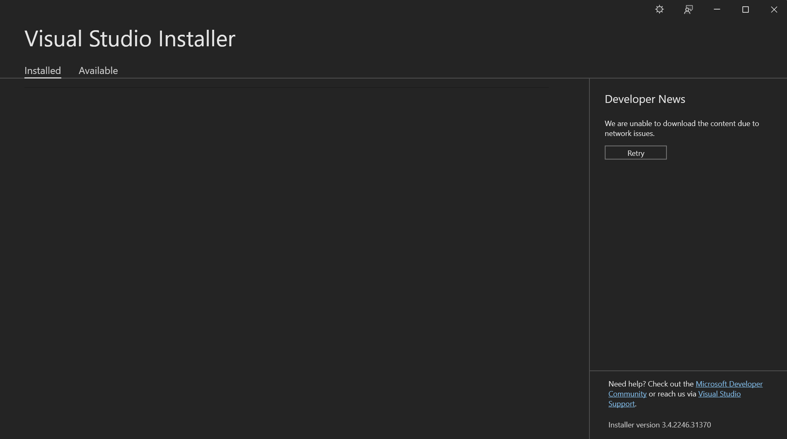
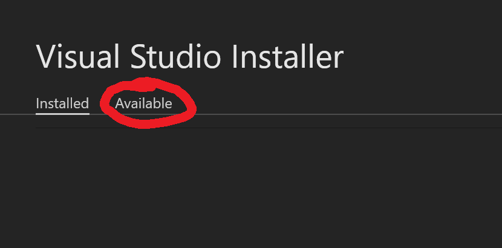

# 2. Installing Visual Studio

This will explain how to install Visual Studio, with it you will be able to go much farther than just making mods for Desktop Goose.

## What's required

* ###**10-11 gigs of storage**
To install Visual Studio and have some projects.

* ###**Have a decent computer with at minimum 8 gigs of ram (4 is acceptable, don't expect the best preformance)** 
This will allow you to run it without it freezing/crashing... too much.

## Installation

Once you slam through all the "Next" buttons on the installer, you will come to a screen that looks like this.

Once you're in the installer click the "Avaliable" tab... button... page... ***thing***

{ width=500 }

Once you are there, there will be something that says Visual Studio Community then a year, this tutorial will be on Visual Studio Community 2022, but any other version *should* work but I cant bee too sure.

Once its installed, click the modify button and you'll be brought a list of some selectable squares, select ".Net desktop development" and "Universal Windows Platform development" and click install in the bottom right corner, yes it requires administrator.
