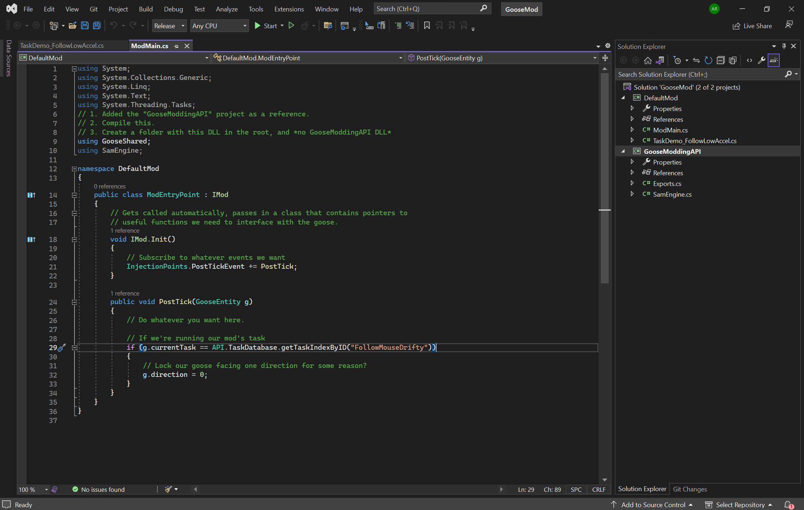
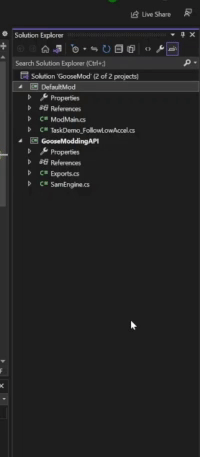

#Actually coding on your project

So now that you're in your "**Modmain.cs**" file, lets actually code something.

##Making the goose follow the mouse constantly

So, your on your project, which will look like this. 

Remove the code that says

    if (g.currentTask == API.TaskDatabase.getTaskIndexByID("FollowMouseDrifty"))
    {
        // Lock our goose facing one direction for some reason?
        g.direction = 0;
    }

and remove all the comments.

Making the goose follow the mouse is actually a simple task, and it can be done with only a single line of code! 

Add the line

    g.targetPos = new Vector2(Input.mouseX, Input.mouseY);

Then add this line of code to the start of the file, to use mouse inputs.

    using System.IO;

{ align=right }
In the "**PostTick()**" function, the letter g, is how we interact with the goose entity, targetPos is a variable in the goose entity, and we are supplying it with a vector2, of the mouse x cord, and the mouse y cord.

So to compile this code, (as shown on the right) you right click DefaultMod in the solution explorer, and select the first item in the dropdown, which is "**build**". Once you do that, go to file explorer, and navigate into the folders "DefaultMod/bin/Release" and copy "DefaultMod.dll" into (from main desktop goose dir) "Assets/Mods" and create a folder with the same name as your dll, but without the .dll bit, so DefaultMod, and copy your DefaultMod.dll into that folder, and start desktop goose (with mods enabled).

Look in the QOL folder [**here**](../QOL/compmod.md) for some better and more effective ways to do this.